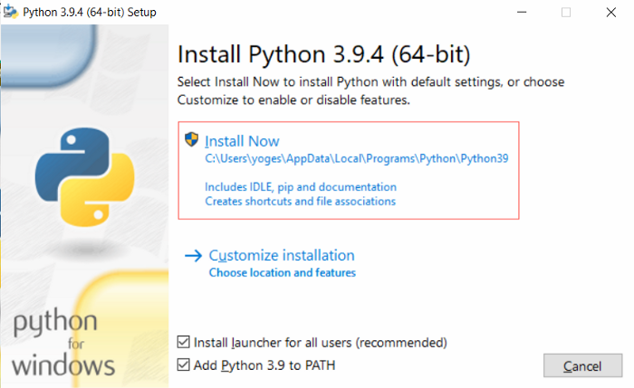
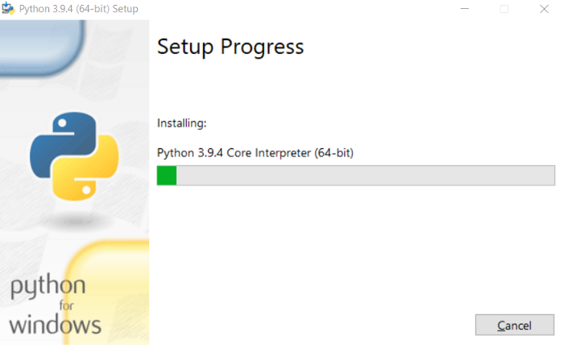
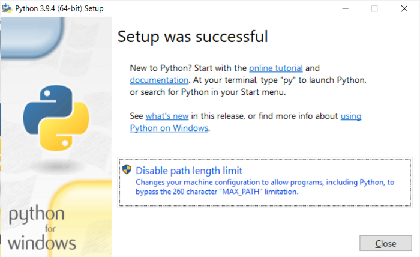

# Python dersleri

## _Python nedir, amaçları nelerdir_

Python, üst düzey, genel amaçlı ve çok popüler bir programlama dilidir. Python programlama dili (en son Python 3), Yazılım Endüstrisindeki tüm son teknolojilerle birlikte web geliştirme, Makine Öğrenimi uygulamalarında kullanılmaktadır. Python Programlama Dili, Yeni Başlayanlar ve ayrıca C++ ve Java gibi diğer programlama dillerine sahip deneyimli programcılar için çok uygundur.
Bu özel olarak tasarlanmış Python öğreticisi, temelden ileri düzeye (Web-scraping, Django, Deep-Learning vb.) konularla örneklerle Python Programlama Dilini en verimli şekilde öğrenmenize yardımcı olacaktır.

Python Programlama Dili hakkında bazı gerçekler aşağıdadır:
- Python şu anda en yaygın kullanılan çok amaçlı, üst düzey programlama dilidir.

- Python, Nesne Yönelimli ve Prosedürel paradigmalarda programlamaya izin verir.

- Python programları genellikle Java gibi diğer programlama dillerinden daha küçüktür. Programcıların nispeten daha az yazmaları gerekir ve dilin girinti gereksinimi onları her zaman okunabilir kılar.

- Python dili, Google, Amazon, Facebook, Instagram, Dropbox, Uber… gibi neredeyse tüm teknoloji devi şirketler tarafından kullanılıyor.

-  Python'un en büyük gücü, aşağıdakiler için kullanılabilecek devasa standart kitaplık koleksiyonudur:
    - Makine öğrenme
    - GUI Uygulamaları ( Kivy , Tkinter, PyQt vb. gibi)

    - Django gibi web çerçeveleri (YouTube, Instagram, Dropbox tarafından kullanılır)

     - Görüntü işleme ( OpenCV , Pillow gibi )

    - Web kazıma (Scrapy, BeautifulSoup, Selenium gibi)

    - Test çerçeveleri

    - Multimedya

     - Bilimsel hesaplama

    - Metin işleme ve daha fazlası..

#
# Python kurulumu 
[python](https://www.python.org/downloads/) adresinden Python kurulumu yapılabilir.

Python Executable Installer'ı indirin ve kurun
İndirilen yürütülebilir dosyaya çift tıklayın;
aşağıdaki pencere açılacaktır. 

 Customize installation'i seçin ve devam edin.

Add Path onay kutusuna tıklayın, Python yolunu otomatik olarak ayarlayacaktır.

İndirdikten sonra Python Installer'ı çalıştırın. (Bu örnekte Python 3.9.4'ü indirdik)

"Install launcher for all users" ve "Add Python 3.9 to PATH" onay kutularını seçtiğinizden emin olun.

Şimdi Kur'u seçin - önerilen kurulum seçenekleri.

